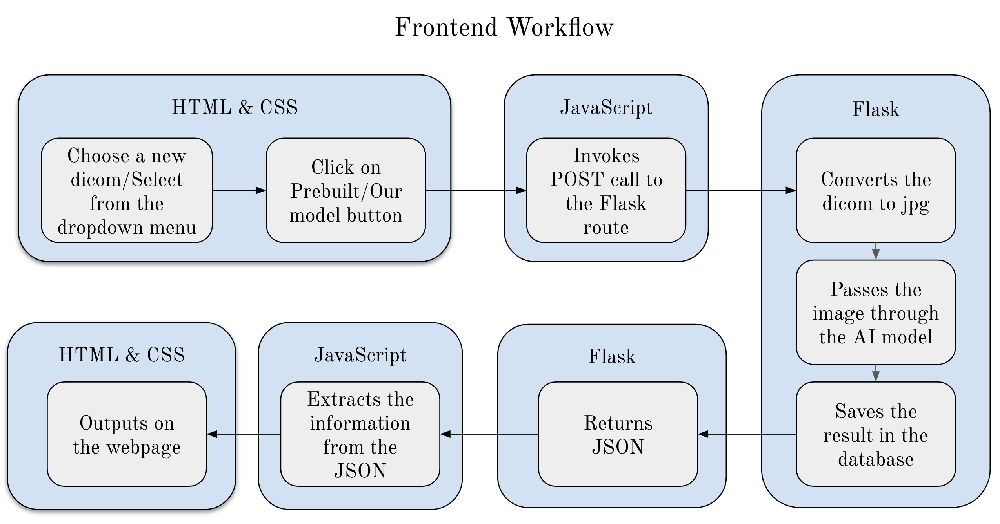

# ChestLens AI

## Description

Currently, radiologists manually analyze chest X-ray images to find any abnormalities, injuries, or diseases. This can be very time-consuming and like all things has the possibility of errors. To mitigate this issue we implemented an AI model to identify six common findings. These include Atelectasis, Cardiomegaly, Consolidation, Edema, No Finding, and Pleural Effusion. The main objective of using an AI model on chest X-rays is to help radiologists identify negative results or identify which of these diseases are present and the location of these diseases with the use of visual mapping.

## Getting started

1. **Clone this repository.**

2. **Install the required dependencies.**
    ```sh
    pip install -r requirements.txt
    ```

3. **Navigate to the client folder.**
    ```sh
    cd src/client
    ```

4. **Run the program.**
    ```sh
    python3 index.py
    ```

5. **Go to http://localhost:9874.**

6. **Demo username: doctor3@gmail.com, password: password3.**

7. **Demo DICOM images available in src/demo_images.**

## Workflow Diagrams




## Data Split

Dataset: MIMIC-CXR-JPG

The dataset contains 10 folders p10-p19 and here is the data split:

Training (70%): Folders 10-16

Validation (10%): Folder 17

Testing (20%): Folders 18 and 19

## References

1. **OpenCV**

    https://github.com/opencv/opencv-python?tab=MIT-1-ov-file

2. **PyTorch Grad Cam**

    https://github.com/jacobgil/pytorch-grad-cam?tab=MIT-1-ov-file

3. **TorchXRayVision**

    https://github.com/mlmed/torchxrayvision?tab=Apache-2.0-1-ov-file

4. **MIMIC Dataset Resources**

    https://doi.org/10.13026/jsn5-t979

    https://physionet.org/content/mimic-cxr/2.0.0/

    Johnson, A., Lungren, M., Peng, Y., Lu, Z., Mark, R., Berkowitz, S., & Horng, S. (2024). MIMIC-CXR-JPG - chest radiographs with structured labels (version 2.1.0). PhysioNet.

    Johnson, A. E., Pollard, T. J., Greenbaum, N. R., Lungren, M. P., Deng, C. Y., Peng, Y., ... & Horng, S. (2019). MIMIC-CXR-JPG, a large publicly available database of labeled chest radiographs. arXiv preprint arXiv:1901.07042.

    Goldberger, A., Amaral, L., Glass, L., Hausdorff, J., Ivanov, P. C., Mark, R., ... & Stanley, H. E. (2000). PhysioBank, PhysioToolkit, and PhysioNet: Components of a new research resource for complex physiologic signals. Circulation [Online]. 101 (23), pp. e215–e220.